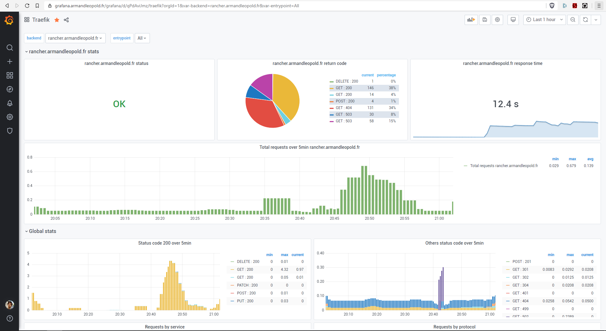

# Capstone Project : Personnal Datacenter With a **Cloud DevOps** approach

The objective for me of this capstone project is to be able to write code and operationnalize it in a test & production environment. As automated with CI/CD pipelines as possible.

In this project, i will demonstrate my abbility to create a Kubernetes Cluster from buying hardware parts, to making all the configuration & download required to make a sustanable & relliable cluster for operation use.

With it, i will develop and host my personnal website blog. And variety of other POC projects.

# Summary :
* [1. Making the Kubernetes Cluster](#1-making-the-kubernetes-cluster)
	* [1.1 Hardware](#hardware)
	* [1.2 Infrastructure](#infrastructure)
	* [1.3 Network](#network)
* [2. Configuring the Environment](#2-configuring-the-environment)
	* [2.1 OS Install](os-boot-install/README.md)
	* [2.2 Install K3S](k3s-install/README.md)
	* [2.3 Helm Chart Install](helm-charts-install/README.md)
	* [2.4 CI/CD Install](ci-cd-install/README.md)
* [3. Making a CI/CD Pipeline](#3-making-a-cicd-pipeline)

# 1. Making the Kubernetes Cluster

> from https://github.com/armandleopold/raspberry-cluster

## Raspberry Cluster
Raspberry PI4 4Go Cluster for a DevOps Global Project

## Hardware : 

* [4x raspberry pi 4Go](https://www.amazon.fr/gp/product/B07TC2BK1X/ref=ppx_yo_dt_b_asin_title_o03_s00?ie=UTF8&psc=1) 4*64€ = 256€
* [PowerPort USB Anker](https://www.amazon.fr/gp/product/B072K4TB67/ref=ppx_yo_dt_b_asin_title_o03_s02?ie=UTF8&psc=1) 29.99€
* [4x USB C Power Cables](https://www.amazon.fr/gp/product/B07GWF92B5/ref=ppx_yo_dt_b_asin_image_o03_s02?ie=UTF8&psc=1) 9.99€
* [TP Link Switch 5 Gigabit Ethernet](https://www.amazon.fr/gp/product/B00A128S24/ref=ppx_yo_dt_b_asin_title_o03_s01?ie=UTF8&psc=1) 15.95€
* [GeeekPi Case](https://www.amazon.fr/gp/product/B07Z4GRQGH/ref=ppx_yo_dt_b_asin_title_o03_s00?ie=UTF8&psc=1) 19.99€
* [5x Cat6 RJ46 Rankie Ethernet Cables](https://www.amazon.fr/gp/product/B01J8MDV5G/ref=ppx_yo_dt_b_asin_title_o03_s00?ie=UTF8&psc=1) 9.99€
* [4x Samsung Evo Plus 128Go MicroSD Card](https://www.amazon.fr/gp/product/B06XFHQGB9/ref=ppx_yo_dt_b_asin_title_o02_s00?ie=UTF8&psc=1) 4*23.48€ = 93.92€

**Total : 435.74€**

### Extra hardware :
* [Ubiquiti Edge Router X](https://www.amazon.fr/gp/product/B011N1IT2A/ref=ppx_yo_dt_b_asin_title_o01_s00?ie=UTF8&psc=1) 57.91€
* [Alxum NVMe M.2 Drive Case](https://www.amazon.fr/gp/product/B07SLHRHQG/ref=ppx_yo_dt_b_asin_title_o00_s00?ie=UTF8&psc=1) 42.99€
* [YUCUN NVMe 240Go SSD Drive](https://www.amazon.fr/gp/product/B07HVSF68X/ref=ppx_yo_dt_b_asin_title_o00_s01?ie=UTF8&psc=1) 39.99€

**Total : 140.89€**

**Big Total : 576.63€**

## Infrastructure : 

## Network : 

## Result :

Now that i have a cluster, let's make it alive !

# 2. Configuring the Environment

> from https://github.com/armandleopold/raspberry-install-scripts

## Raspberry Install Scripts
Scripts and configuration tunning i use to setup my raspberry cluster.

* [1. OS Install](os-boot-install/README.md)
* [2. Install K3S](k3s-install/README.md)
* [3. Helm Chart Install](helm-charts-install/README.md)
* [4. CI/CD Install](ci-cd-install/README.md)

### Sources : 
* http://www.pidramble.com/wiki
* https://blog.alexellis.io/serverless-kubernetes-on-raspberry-pi/
* https://gitlab.com/xavki/raspberry-tricks
* https://github.com/likamrat/ARMadillo
* https://github.com/Raspbernetes

## Result : 

* Managing the Router & monitoring traffic : https://armandleopold.unmsapp.com/nms/dashboard

* Managing the load balancing Inbound/Outbound Kubernetes : https://traefik.armandleopold.fr/dashboard/

* Monitoring Node Metrics : https://grafana.armandleopold.fr/grafana/d/hb7fSE0Zz/node-exporter?orgId=1

* Monitoring Endpoints Metrics : https://grafana.armandleopold.fr/grafana/d/qPdAviJmz/traefik?orgId=1&var-backend=rancher.armandleopold.fr&var-entrypoint=All

* Monitoring Kubernetes Clusters & Ressources : https://rancher.armandleopold.fr/

* Managing isolation of ressources & Projects/namespaces in kubernetes

* Having own CI/CD runners :

Now that i have setup all the managing tools for my cluster, let's make something out of it !

# 3. Making a CI/CD Pipeline

I first had to create groups for managing different steps of the process. I will be using different git repositories for :

- Application Source files
- Docker packaging process Files
- Helm Infrastructure As Code Chart

The process is the following :

**aleopold-sources-web ---> aleopold-docker-images ---> aleopold-helm-charts**

## As the platform for managing git repositories, i will be using https://gitlab.com/

To chain the different source repositories i will be using **Gitlab Pipeline Triggers** 
> See more here : https://docs.gitlab.com/ee/ci/yaml/

## Application sources & code linting :

> You can find the sources here : https://github.com/armandleopold/blog

We test the linting process for html index page :

We edit the files :

And it passes the linting process & triggers the docker build repository for those sources :

## Docker Image building : 
> You can find the sources here : https://github.com/armandleopold/blog-docker

We Build the multiarch docker image

We build the image and upload it to the gitlab-repostitory, it then triggers the helm chart deployement repository.

## Helm deployement to kubernetes :

> You can find the sources here : https://github.com/armandleopold/blog-deployement

We then automatically trigger the helm deployement to dev/test environment :  

We can go to https://dev.armandleopold.fr to test our deployement

When we are satisfied, we clic on the **[deploy-to-prod]** Button and then it deploys the release to Production environment (namespace in our case).

We can finally admire our work at https://armandleopold.fr

# Et Voila !

Hope you enjoyed our little ride.
Thank you =)

*Credits for pictures : Armand LEOPOLD*
